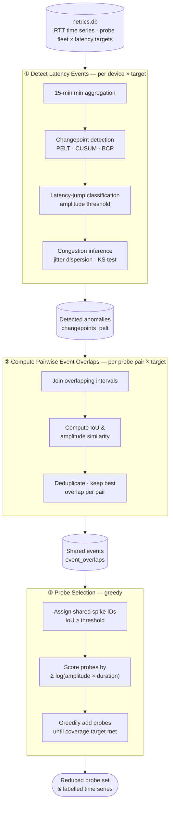

# Optimizing Probe Selection Using Shared Latency Anomalies

Given RTT time series from a fleet of network measurement probes (Netrics/FLOTO), this project detects latency inflation events per probe, identifies which events are shared across probes, and selects the smallest subset of probes that collectively captures a target fraction of total anomaly impact.



## Setup

Requires [uv](https://docs.astral.sh/uv/).

```bash
git clone <repo>
cd probe-selection
make install
```

Download `netrics.db` from [here](https://drive.google.com/file/d/1BX-Edkf_JZPvpUTxKc50oSS8rF7Mw8FK/view?usp=sharing) and place it at the project root.

## Pipeline

Run the steps in order. Subsequent runs skip steps whose outputs are already cached.

### Step 1 — Detect latency events

Runs the Jitterbug changepoint detection pipeline on every (device, latency target) pair and saves detected anomalies as a Parquet file.

```bash
make detect-jumps
```

Key options (pass via `uv run detect-jumps` directly to override defaults):

- `--pelt-penalty` (default `0.001`) — PELT sensitivity; lower = more changepoints
- `--jump-threshold` (default `0.5`) — minimum RTT increase (ms) to count as a latency jump

### Step 2 — Compute pairwise spike overlaps

For every pair of probes that share a latency target, finds intervals where both probes detected an anomaly at the same time and records the overlap (IoU) and amplitude similarity.

```bash
make overlaps
```

Output: `event_overlaps` table written into `netrics.db`.

### Step 3 — Run probe selection

Assigns shared spike IDs to overlapping events, then runs greedy probe selection to find the smallest probe set covering a target fraction of total anomaly impact. Outputs reduced datasets as Parquet files under `/data/device_placement/`.

```bash
make select-probes
```

### Run the full pipeline

```bash
make pipeline
```

## Using the API Directly

```python
import duckdb
from src.apis.jitterbug_analyzer import JitterbugAnalyzer
from src.apis.device_processor import DeviceProcessor
from src.apis.congestion_detection import CongestionDetector
from src.optimization.baselines import assign_spike_ids, produce_reduced_dataset

# Detect congestion on a single device
con = duckdb.connect("netrics.db", read_only=True)
detector = CongestionDetector(con, cdp_algorithm="pelt", pelt_penalty=0.001)
changepoints = detector.slide_window_and_detect_congestion("device-id", "chicago")

# Or use JitterbugAnalyzer directly on a DataFrame
analyzer = JitterbugAnalyzer(inference_method="jd", cdp_algorithm="pelt")
rtts_df, mins_df, mdev_df = analyzer.load_rtts(df)
results = analyzer.analyze(rtts_df, mins_df, mdev_df)
```

## Detection Methods

**Changepoint detection** (`cdp_algorithm`): `pelt` (default), `cusum`, `bcp`

**Congestion inference** (`inference_method`):

- `jd` (default) — jitter dispersion: classifies a segment as congestion when RTT variance increases
- `ks` — Kolmogorov–Smirnov test comparing segment RTT distributions
- `lj_only` — latency jump amplitude only; skips jitter analysis
